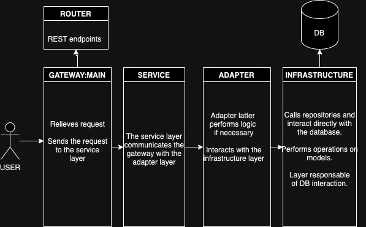

# api-pi

A REST API that implements some common REST endpoints on a Character(GET, POST, DELETE).

## Solution's Architecture

The app's architecture follows the following architecure, ensuring good practices and single responsability principle.



### Setup project 

1. Clone/fork repoo

### Using Docker:

2. In the root folder run:

```bash
docker build -f docker/Dockerfile.dev -t api-pi .
docker run -p 8000:8000 -v $(pwd)/app/database:/app/database api-pi
```

3. Once the container is running, to run unit tests:

```bash
docker exec <CONTAINER ID> pytest --cov=app --cov-report=html --cov-report=term tests/
```
### Without Docker

2. In the root folder run:

```bash
python -m venv .venv
source .venv/bin/activate
pip install -r requirements.txt
exec uvicorn app.main:app --reload --host 0.0.0.0
```

3. Once the project is up, to run unit tests:

```bash
pytest --cov=app --cov-report=html --cov-report=term tests/
```

Once the SQLLite DB is started, a file called database.db will be created inside app/database. That file will persist the data.

The -v $(pwd)/app/database:/app/database tag in Docker version is to set a volume to persist that file data in your local environment.

## Endpoints

* **/v1/character/getAll**: Returns all characters
**method**: GET

Sample response:
```
STATUS CODE: 200
[
    {
        "id": 3,
        "name": "Boromir",
        "height": 180.0,
        "mass": 95.0,
        "birth_year": 100,
        "eye_color": "brown"
    },
    {
        "id": 10,
        "name": "Legolas",
        "height": 190.0,
        "mass": 90.0,
        "birth_year": 90,
        "eye_color": "blue"
    }
]
```

* **/v1/character/get/{id}**: Returns character by id.
**method**: GET

Sample response when ID exists:
```
STATUS CODE: 200
{
    "id": 10,
    "name": "Legolas",
    "height": 190.0,
    "mass": 90.0,
    "hair_color": "white",
    "skin_color": "white",
    "eye_color": "blue",
    "birth_year": 90
}
```

Sample response when ID doesn't exost.

```
STATUS CODE: 400
{
    "detail": "Character ID not found."
}
```

* **/v1/character/add**: Creates a new character. All fields are required.
**method**: POST
Sample response when ID is available:

```
STATUS CODE: 200
{
    "id": 1,
    "name": "Frodo",
    "height": 100.0,
    "mass": 55.0,
    "hair_color": "black",
    "skin_color": "white",
    "eye_color": "blue",
    "birth_year": 200
}
```

Sample response when ID is unavailable:

```
STATUS CODE: 400
{
    "detail": "Character ID already exists."
}
```

* **/v1/character/delete/{id}**: Deletes character by id.
**method**: DELETE

Sample response when character exists:
```
STATUS CODE: 200
{
    "detail": "Character with id 1 deleted successfully"
}
```

Sample response when character ID doesn't exist:
```
STATUS CODE: 400
{
    "detail": "Character ID not found."
}
```

### Postman Collection

A POSTMan collection is added to this repo so that some operations can be easily ran.

There are successful and unseccessful requests to tests functionality.


